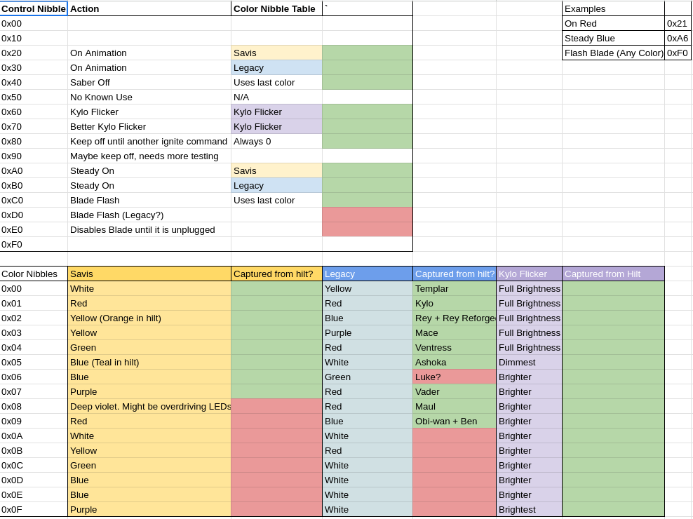
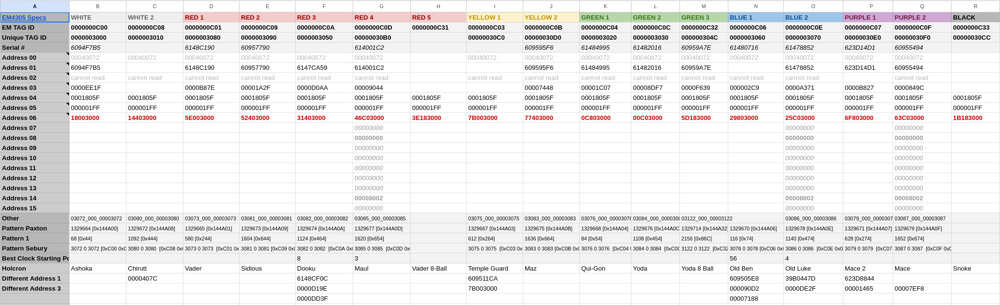
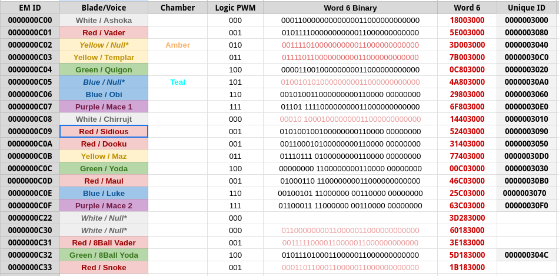
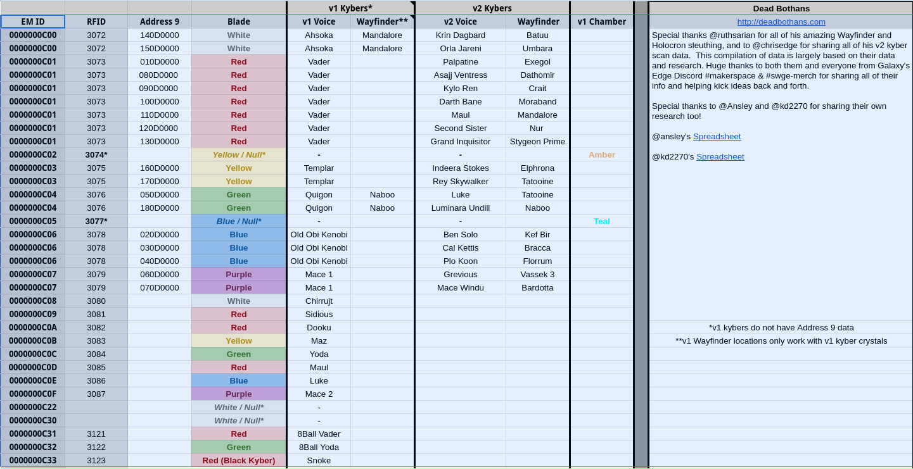

# Kyber Crystals

A how to program crystals from https://sabersourcing.com/2019/10/30/kyber-crystal-rfid-hack-star-wars-galaxys-edge/  
1. Turn on RFID Reader/Writer (make sure it’s set to 125KHz). Hold the kyber crystal next to the device and click the “Read” button. The device will say “Read success” and recite the current RFID number of the kyber crystal.
2. Next, click the “Input” button. Enter the four digit number for your desired lightsaber blade color and dialogue set (see the complete list of RFID codes below). Press “Input” one more time.
3. Hold the kyber crystal next to the device and the click the “Write” button. If desired, use one of the option RFID key fobs instead of the kyber crystal itself. The device will say “Write success” to indicate that writing to the device worked.
4. Now you have reprogrammed the kyber crystal! Attach the kyber crystal to your Jedi Holocron or Sith Holocron to hear the dialogue of the reprogrammed kyber crystal. Alternatively, install the kyber crystal in your Savi’s Workshop lightsaber to view the new blade color.

From this froum post by mrgoodfellow https://forum.flipper.net/t/star-wars-galaxy-s-edge-kyber-crystal/2611/11

I have scanned several crystals and the example contents are:

BlueKyber.rfid -  
Filetype: Flipper RFID key  
Version: 1  
Key type: EM4100  
Data: 00 00 00 0C 0E  

Here is a table of HEX converted values:

Ahsoka Tano dialogue	White	3072	0000000C00  
Darth Vader dialogue	Red	3073	0000000C01  
Unreleased	Orange	3074	0000000C02  
Jedi Temple Guard dialogue	Yellow	3075	0000000C03  
Qui-Gon Jinn dialogue	Green	3076	0000000C04  
Unreleased	Teal	3077	0000000C05  
Obi-Wan Kenobi (Original Trilogy era) dialogue	Blue	3078	0000000C06  
Mace Windu (set 1) dialogue	Purple	3079	0000000C07  
Chirrut Imwe dialogue	White	3080	0000000C08  
Emperor Palpatine dialogue	Red	3081	0000000C09  
Count Dooku dialogue	Red	3082	0000000C0A  
Maz Kanata dialogue	Yellow	3083	0000000C0B  
Yoda dialogue	Green	3084	0000000C0C  
Darth Maul dialogue	Red	3085	0000000C0D  
Luke Skywalker (Sequel Trilogy era) dialogue	Blue	3086	0000000C0E  
Mace Windu (set 2) dialogue	Purple	3087	0000000C0F  
Darth Vader (Magic 8 Ball) dialogue	Red	3121	0000000C31  
Yoda (Magic 8 Ball) dialogue	Green	3122	0000000C32  
Snoke dialogue (note: this is from the black kyber crystal)	Red	3123	0000000C33  
I have been unsuccessful at unlocking or flashing any of the crystals or getting the flipper to emulate a crystal next to the saber in a way that changes the color. I have ordered some re-writable chips to create my own re-writable crystal. I will see if I have any success with them.

Here is a bunch of screenshots from https://docs.google.com/spreadsheets/d/1mZMBBxSc_ltAyheEVgKL4MpGfPc3iCjR1S6BEaavN40/edit#gid=1994856546  
(for some stupid reason they tuned off saving the doc to make things easy, so thank who ever did that and enjoy the pics lol)

Updated 5/12/24

