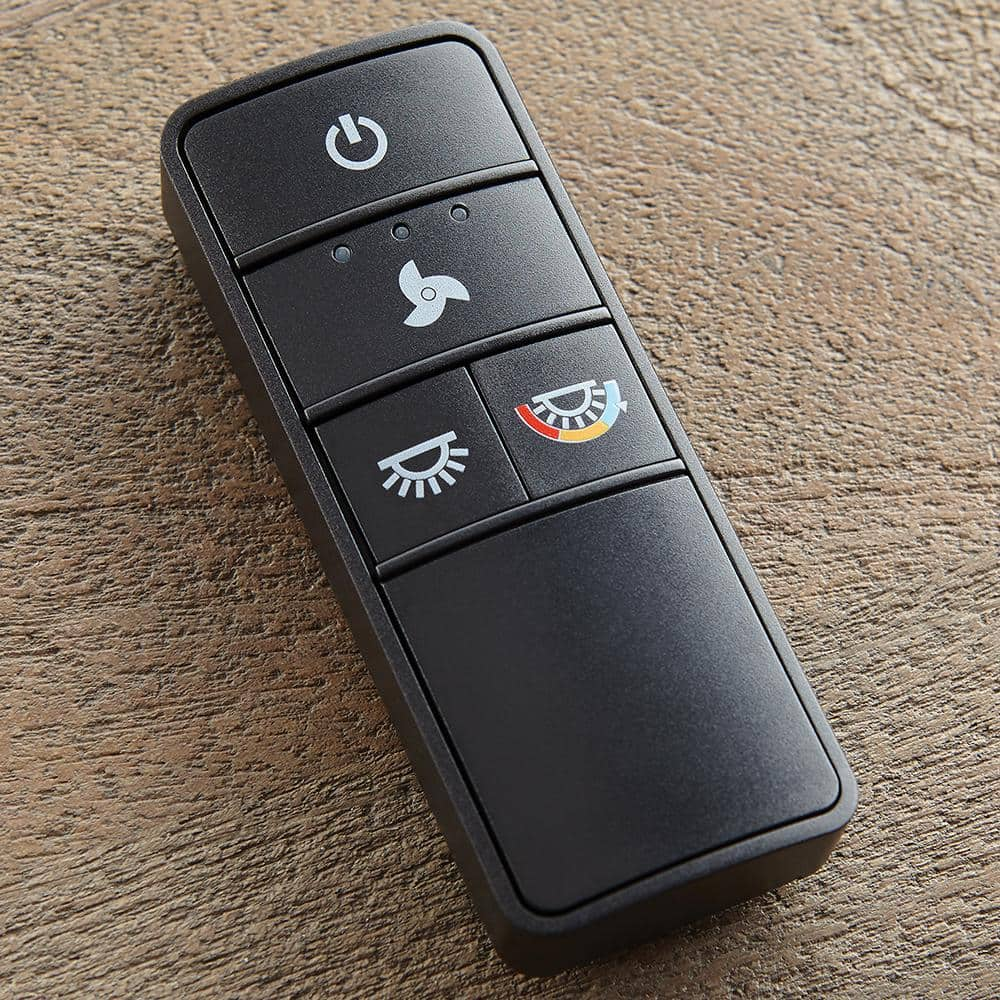

# TX028C-S Fan Remote #

FCC Link: [https://fcc.report/FCC-ID/A25-TX028](https://fcc.report/FCC-ID/A25-TX028)

Copied from a fan from Home Depot ( [Link](https://www.homedepot.com/p/Home-Decorators-Collection-Ashby-Park-52-in-White-Color-Changing-Integrated-LED-Brushed-Nickel-Ceiling-Fan-with-Light-Kit-and-Remote-Control-59252/308039187) ):

>Home Decorators Collection - Ashby Park 52 in. White Color Changing Integrated LED Brushed Nickel Ceiling Fan with Light Kit and Remote Control

It is used with more than that one fan, but this is the product that it came with when these codes were copied.

There are 4 DIP switches inside the battery cover, so the different codes correspond to the positions of those switches

The light_color_temp_toggle.sub files toggle the light between the different color temperatures.

The light dimming button is a bit weird to use. On the remote, you hold the button and it continuously sends a signal. Using the same code read with the flipper requires you to continuously tap the button to keep the dimming ramping up and down. About 3 seconds of raw capture was performed for code 1111, allowing a single button press for a decent range of dimming, but this was not done for other codes due to the time involved.