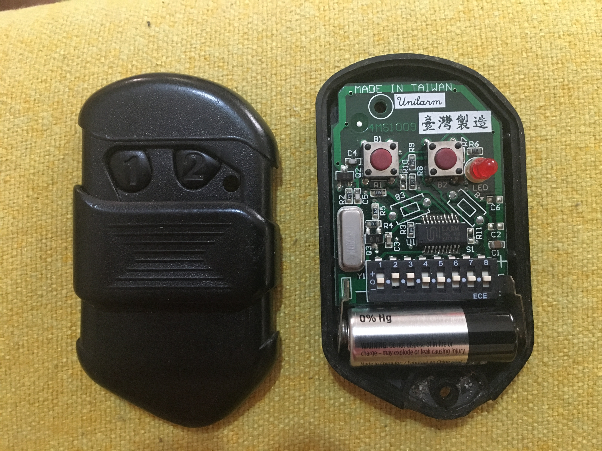
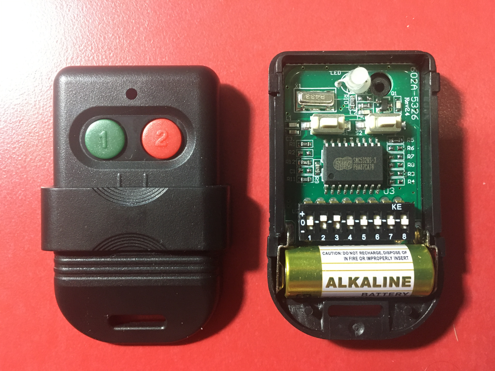
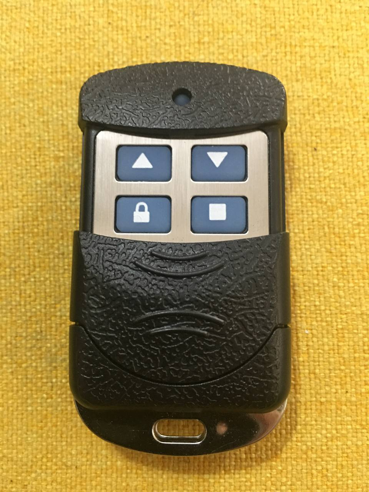
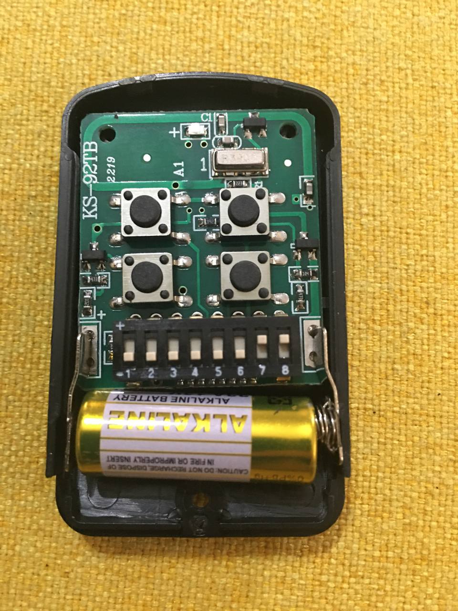
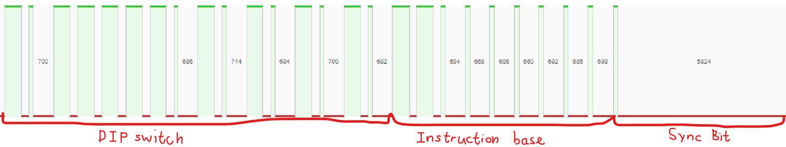
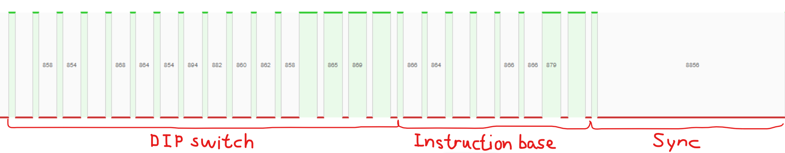

# Brute Force Gate Remote using Flipper Zero
## Original by [Hong5489](https://github.com/Hong5489/flipperzero-gate-bruteforce)

Brute force gate remote for SMC5326, UNILARM and PT2260 using Flipper Zero, inspired by [Breaking Protocol](https://medium.com/csg-govtech/breaking-protocol-d3988fa85eef) and [flipperzero-bruteforce](https://github.com/tobiabocchi/flipperzero-bruteforce)

Only works on UNILARM, SMC5326, PT2260 and others remote that using the same protocol.

Also can read my [blog post](https://hong5489.github.io/2022-09-23-gate-protocol/) on how I investigate the gate remote protocol

## UNILARM remote sample

## SMC5326 remote sample

## PT2260 remote sample

## Protocol Structure

### UNILARM & SMC5326

[ 16bits of DIP switch combinations ][ 9bits of Instruction base ]

Example in [Pulse Plotter](https://my.flipp.dev/pulse-plotter): 

### PT2260

[ 16bits of DIP switch combinations ][ 8bits of Instruction base ]

Example in [Pulse Plotter](https://my.flipp.dev/pulse-plotter): 

Both protocol is similar to the PT-2262 Format (Princeton). More info [here in russian](https://phreakerclub.com/447)

### UNILARM
- 150μs high 650μs low represent `0`, 550μs high 250μs low represent `1`
- Button 1 Instruction: 110000000
- Button 2 Instruction: 001100000

### SMC5326
- 300μs high 900μs low represent `0`, 900μs high 300μs low represent `1`
- Button 1 Instruction: 111010101
- Button 2 Instruction: 101110101

### PT2260
- 300μs high 850μs low represent `0`, 850μs high 300μs low represent `1`
- Button open Instruction: 00000011
- Button lock Instruction: 00001100
- Button stop Instruction: 00110000
- Button close Instruction: 11000000

[Sample raw .sub files here](raw_sample)

## DIP switch

Switch | UNILARM | SMC5326 | PT2260
---|---|---|---
`+` | 11 | 11 | 11
`o` | 10 | 10 | 01
`-` | 00 | 00 | 00

# How it works

Using `generate.py` you can generate all the .sub files to brute force, or you can directly copy the generated .sub files into the flipper's SD card under the `/subghz` folder

Under `6561` folder got 1 file contains all 6561 combinations of DIP switch, `2187` contains 3 sub files that contains 2187 combinations, and `729` contains 9 sub files etc. (The less the combinations the more the sub files)

To brute force all combinations of DIP switch, simply run the `0_0.sub` in the `6561` folder

To narrow down the brute force time, you need to run multiple times (Something like binary search)

For example:

1. Your gate remote is `SMC5326` and frequency is `330MHz`
2. Copy the folder `SMC5326_330` into flipper's sdcard `subghz` folder
3. Play the `2187/0_0.sub` file and the gate opens
4. Under the `729` folder, play the sub starts with `0`: 0_0,1,2.sub and see which files opens the gate
5. If `0_1.sub` works, then play the sub starts with `1`: 1_3,4,5.sub under `243` folder 
6. Continue narrow down the combinations until you happy with the sending time of the .sub file

**PS: Please test on your own gate or get permission before you test!**
