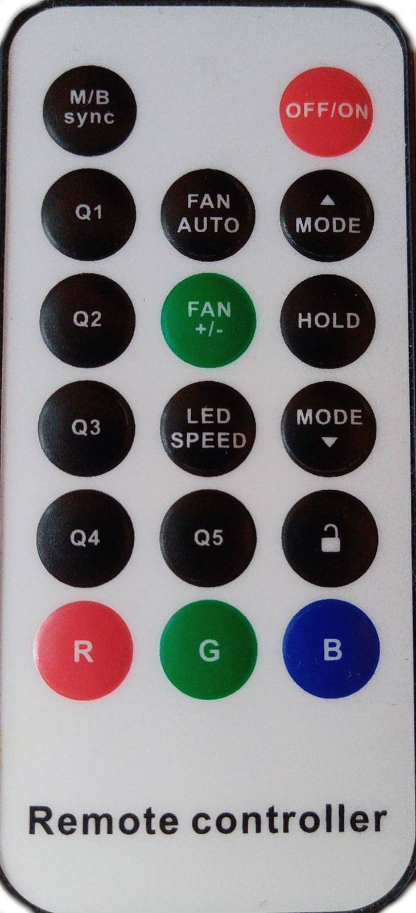

# Aurora RGB

More info: [Aurora](https://www.aurora-gaming.pl/portfolio-item/passion-v5/)

Captured by: [nnesetto](https://github.com/nnesetto)

The controller operates at the frequency of 433.92 MHz.

&nbsp;&nbsp;&nbsp;&nbsp;&nbsp;&nbsp;&nbsp;&nbsp;&nbsp;&nbsp;

