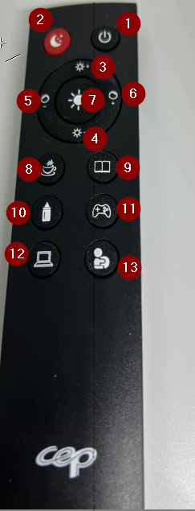

## Remote 

## Button

1 : Power on /Off (開啟關閉)
>
2 : Sleep Mode (睡眠模式)
>
3 : increase intensity of light (by Step (增加光度)
>
4 : Decrease  intensity of light ( (by Step  減少光度)
>
5 : warm color  (by Step (暖色)
>
6 : Cold color(by Step (冷色)
>
7 : Max intensity of Cold color light (最大冷色光度)
>
8 : Cafe Mode (咖啡模式)
> 
9 : Reading Mode (閱讀模式)
>
10 :Feed Mode  (餵食模式)
>
11 : Game Mode (遊戲模式)
>
12 : PC Mode (電腦模式)
>
13 : Body Playing Mode (嬰兒遊玩模式)
 
