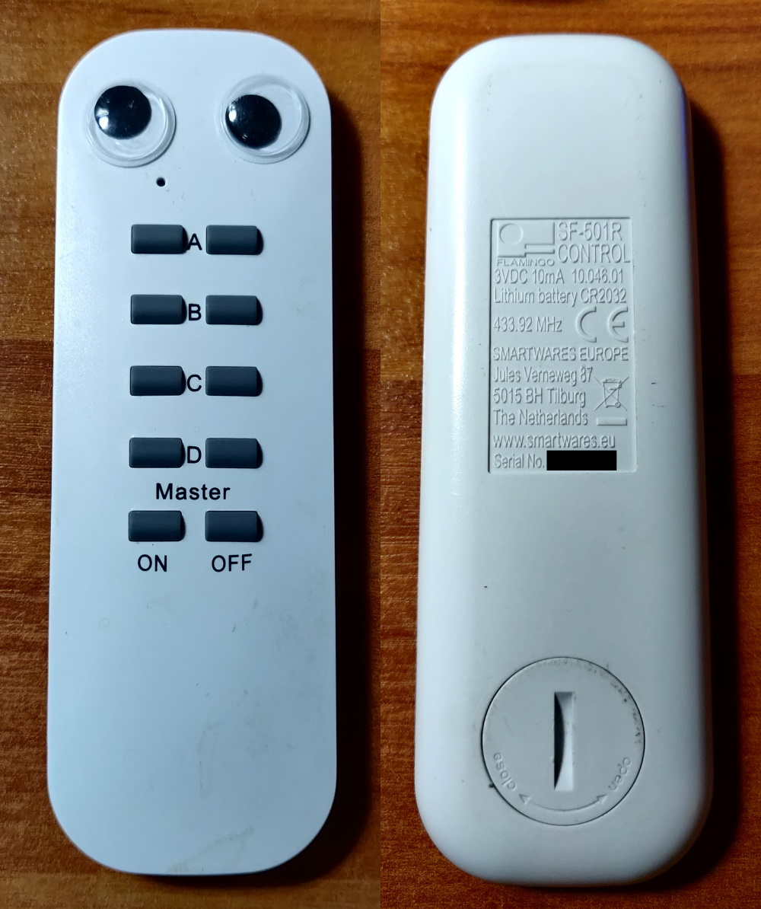
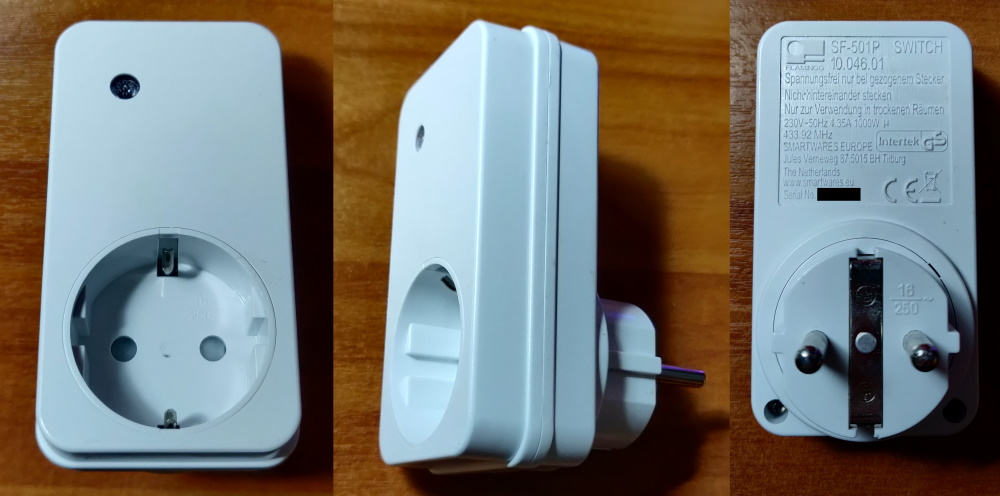

# Flamingo SF-501R / SF-501P

Raw DeBruijn (.sub) signal files from [JKCTech](https://github.com/jkctech/Flipper-Zero-Scripts)

**Compatible with:**

- `Flamingo SF-501R` - Remote
- `Flamingo SF-501P` - Sockets

Might be compatible with more Flamingo Devices

**Pro Tip:** `You should add googly eyes to your remotes as well!`
