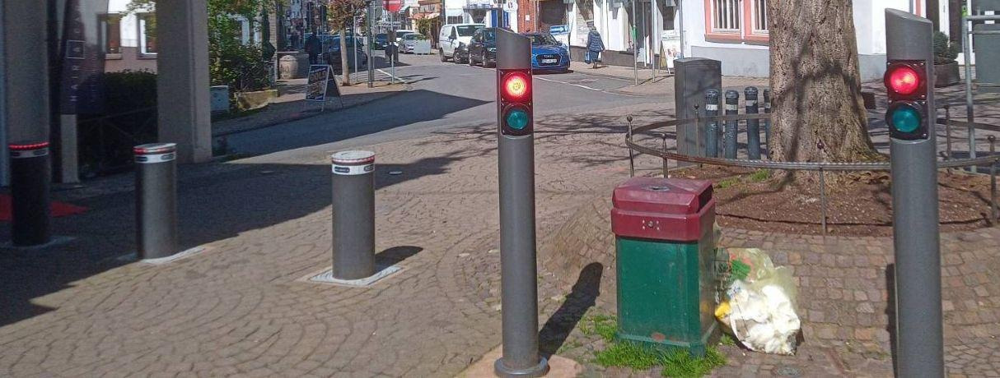

# Roadblock bollards

In this folder **WILL BE** captured Sub-GHz signals from road blocking bollards. 
*(This is a placeholder only for now.)*

An example of what they look like is in the photo below.

